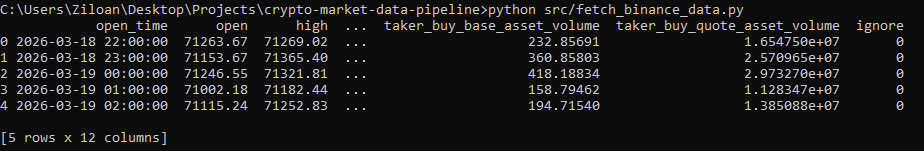

# Crypto Market Data Pipeline


A Python tool for downloading historical cryptocurrency OHLCV market data from the Binance REST API and exporting it as structured CSV datasets.

## Features

- Fetch market candle data
- Convert data into pandas DataFrame
- Export clean CSV datasets
- Command line arguments for symbol, interval, and candle count

## Installation

Install dependencies:

pip install -r requirements.txt

## Usage

Default usage:

python src/fetch_binance_data.py

Custom example:

python src/fetch_binance_data.py --symbol ETHUSDT --interval 15m --limit 500

## Output

The script saves a CSV file in the `data/` folder.

Example:



## Project Structure

```text
crypto-market-data-pipeline/
├── src/
│   └── fetch_binance_data.py
├── data/
│   └── sample_btcusdt_1h.csv
├── examples/
│   └── terminal_output.png
├── README.md
└── requirements.txt
```